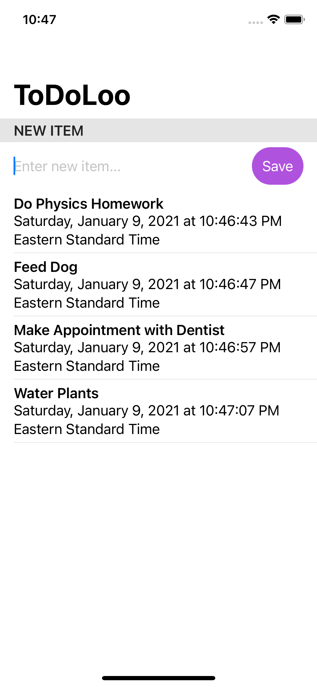

# ToDoLoo

ToDoLoo is a to do list for IOS made using the SwiftUI framework. The app allows the user to add and delete tasks that they would like to remember. The app is compatible with both light and dark mode.

